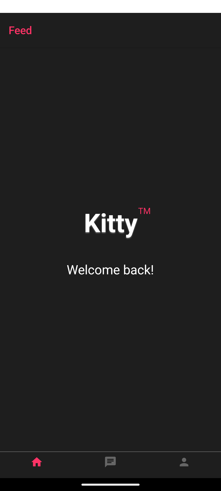

# Kitty Navigation avec Expo Router

Une application mobile React Native construite avec Expo Router, intégrant l'authentification Supabase et une navigation par onglets.

## Aperçu de l'Application

## Fonctionnalités

- 🔐 Authentification avec Supabase
- 📱 Navigation moderne par onglets
- 🎨 Thème sombre avec accents roses
- 🚀 Construit avec Expo Router

## Stack Technique

- Expo SDK
- React Native
- Expo Router pour la navigation
- Supabase pour l'authentification
- React Native Elements pour l'interface utilisateur

## Structure du Projet
