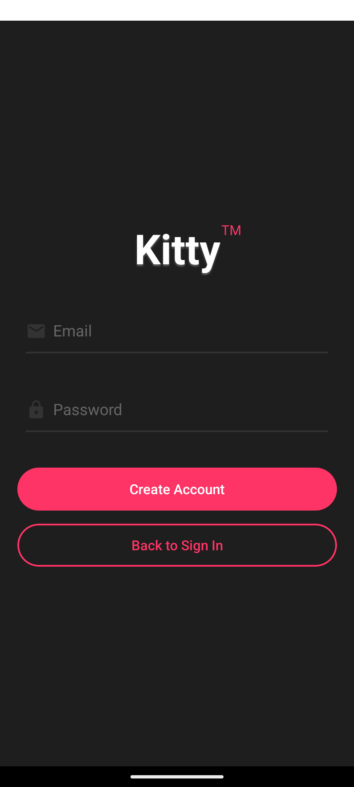
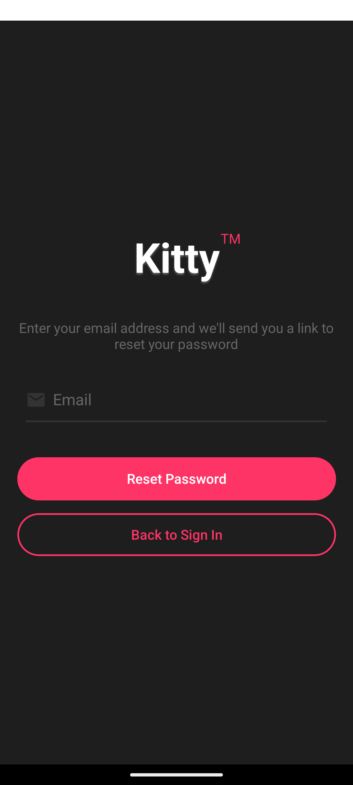

# Kitty™ Authentication App

Une application d'authentification élégante construite avec Expo et Supabase.

## 🎨 Captures d'écran

<div style="display: flex; justify-content: space-between; flex-wrap: wrap;">
  
  
  
</div>

## 🎨 Design & Interface

L'application suit une direction artistique cohérente avec :
- Un thème sombre moderne (`#1E1E1E`)
- Des accents roses (`#FF3366`) pour les éléments interactifs
- Une typographie soignée avec le logo "Kitty™"
- Des icônes en gris foncé (`#333333`)
- Des textes secondaires en gris clair (`#666666`)

## 📱 Pages

### Page de Connexion (Sign In)
- Logo "Kitty™" avec effet d'ombre
- Champs email et mot de passe avec icônes
- Lien "Mot de passe oublié"
- Bouton de connexion rose
- Bouton "Create Account" avec bordure

### Page de Réinitialisation de Mot de Passe
- Interface cohérente avec le reste de l'application
- Formulaire d'email pour la réinitialisation
- Envoi de lien de réinitialisation par email
- Retour facile vers la page de connexion

### Page d'Inscription (Sign Up)
- Design identique à la page de connexion
- Validation des emails déjà existants
- Redirection vers la connexion après inscription
- Envoi d'email de confirmation

### Page d'Accueil (Home)
- Message de bienvenue personnalisé
- Affichage de l'email de l'utilisateur
- Bouton de déconnexion stylisé
- Protection de la route (redirection si non connecté)

## 🛠 Explication Technique des Fichiers

### Configuration
`lib/supabase.ts`
- Configuration du client Supabase avec URL et clé anonyme
- Mise en place du stockage persistant avec AsyncStorage
- Configuration de l'auto-refresh des tokens
- Gestion des sessions persistantes

`app/_layout.tsx`
- Point d'entrée principal de l'application
- Mise en place des providers (ThemeProvider, AuthProvider)
- Gestion du layout global

### Authentification
`contexts/AuthContext.tsx`
- Gestion centralisée de l'état d'authentification
- Hook personnalisé `useAuth` pour accéder à la session
- Écoute des changements d'état d'authentification
- Gestion du statut de chargement

### Pages
`app/(auth)/sign-in.tsx`
- Formulaire de connexion avec validation
- Gestion des erreurs d'authentification
- Lien vers la réinitialisation du mot de passe
- Redirection après connexion réussie
- Styles personnalisés avec makeStyles

`app/(auth)/sign-up.tsx`
- Formulaire d'inscription avec validation
- Vérification des emails existants
- Configuration du lien de redirection email
- Gestion des retours utilisateur

`app/(auth)/reset-password.tsx`
- Formulaire de réinitialisation de mot de passe
- Intégration avec Supabase Auth pour l'envoi d'emails
- Gestion des erreurs et feedback utilisateur
- Navigation fluide vers la connexion

`app/index.tsx`
- Page d'accueil protégée
- Vérification de session active
- Interface utilisateur personnalisée
- Gestion de la déconnexion

### Styles
Chaque composant utilise `makeStyles` de @rneui/base pour :
- Styles isolés par composant
- Thème cohérent
- Réutilisation des couleurs
- Responsive design

## 🛠 Technologies

- **Frontend**: React Native + Expo
- **UI Components**: React Native Elements (@rneui)
- **Authentication**: Supabase Auth
- **Navigation**: Expo Router
- **State Management**: React Context (AuthContext)

## 🔒 Sécurité

- Sessions persistantes avec AsyncStorage
- Refresh automatique des tokens
- Protection des routes authentifiées
- Validation des emails
- Réinitialisation sécurisée des mots de passe

## 🚀 Installation

1. Cloner le repository
2. Installer les dépendances :
```bash
npm install
```

3. Lancer l'application :
```bash
npx expo start
```

## 📦 Structure des fichiers

```
app/
  ├── (auth)/
  │   ├── sign-in.tsx        # Page de connexion
  │   ├── sign-up.tsx        # Page d'inscription
  │   └── reset-password.tsx # Page de réinitialisation
  ├── _layout.tsx            # Layout principal avec providers
  └── index.tsx              # Page d'accueil protégée
contexts/
  └── AuthContext.tsx        # Gestion de l'état d'authentification
lib/
  └── supabase.ts           # Configuration Supabase
```

## 🎯 Fonctionnalités

- Inscription avec validation email
- Connexion sécurisée
- Réinitialisation de mot de passe
- Persistance de session
- Interface utilisateur cohérente
- Navigation fluide entre les pages
- Gestion des erreurs avec feedback utilisateur
